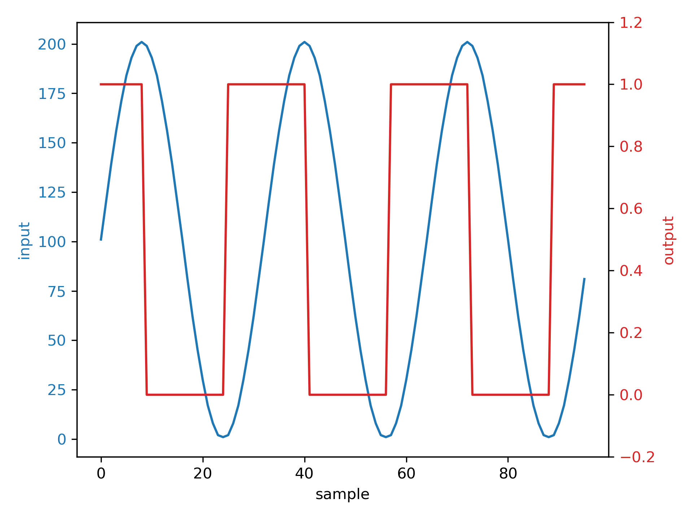
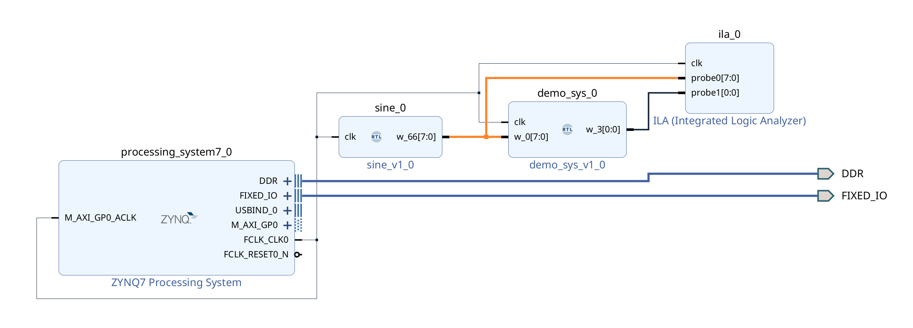

# SynQ
SynQ (**Syn**chronous System Design with **Q**uantitative Types) is an embedded domain-specific language (EDSL) for synchronous system design and an Idris2 package.

## Usage

 - Just as an Idris2 package (cf. [the official documentation](https://idris2.readthedocs.io/en/latest/reference/packages.html#using-package-files)).
 - The simulation functionality depends on C functions introduced as FFI, following [this document](https://idris2.readthedocs.io/en/latest/ffi/ffi.html#ffi-example) to compile `src/c/libbv.c` to `libbv.so` and put it in a proper location.
 - The generated Verilog HDL file consists of the top-level module only; components referred to in the file are defined in `src/verilog/components.v`.

## A Crash Course in SynQ

As its name suggests, SynQ is a DSL targeting the design of synchronous systems, which, intuitively, are reactive systems that always have aligned inputs and outputs.
That is, whenever an event is consumed by a synchronous system, the corresponding event will be produced.
We demonstrate the basic usage of SynQ here by designing a toy system that *monitors if its input is increasing* in SynQ.
Specifically, it will be demonstrated here that:

- how the system is modelled in SynQ;
- how the modelled system can be interpreted and compiled as an Idris2 function, which allows the system to be tested quickly;
- how the modelled system can be interpreted to synthesizable Verilog HDL code; and
- how properties of the modelled system (its interpretation indeed) can be specified and proved in Idris2's type system.

*This file itself is a [literate file](https://idris2.readthedocs.io/en/latest/reference/literate.html), meaning that you can load this file into Idris2 and try it yourself.*

### Step 0: Import SynQ

SynQ is an Idris2 library; once it has been installed, you can import it just like importing other libraries.

```idris
import SynQ
```

<!-- idris
import Data.String
import Data.Vect
import Language.Reflection

%hide Prelude.(>>=)
%hide Prelude.pure
%hide Data.Linear.Interface.seq
%hide Data.LState.(>>=)
%hide Data.LState.(<<<)
%ambiguity_depth 8

%language ElabReflection
-->

### Modelling the System

<!-- idris 
-- so that the type declaration of isIncr comes later
mutual
-->

The system is modelled as follows, in which `MkReg get set`, `abst`, and `ltu` are provided by SynQ.
- `MkReg get set` provides a _register_, or, in the synchronous process network context, a _feedback loop with unit delay_, with two ports locally named `get` (the output port) and `set` (the input port), respectively;
- `abst $ \xin => ...` specifies that the input of the system is referred to as `xin` in the model; and
- ``pre `ltu` xin`` asserts whether `pre` is less than `xin` by treating all operands as unsigned values.

The `do` notation indicates that operations in its scope are applied sequentially on the system's (the register's) state.
That is, for each input event, the system will first retrieve the state of the register (via `get`), bind the retrieved state to the name `pre`, and then update the state to the current input (via `set`), which will be used in the next event.
Finally, the result of comparing `pre` and `ltu` will be the output, and the comparison does not change/rely on the state (suggested by `pure`).

```idris
  isIncr reg@(MkReg get set) =
    abst $ \xin =>
      do pre <- get
         _   <- set xin
         pure $ pre `ltu` xin
```
If you are familiar with **monads**, the code snippet shown above should look natural to you.
It reflects one fact intended to be validated by the design and implementation of SynQ, that:

> Synchronous systems can be modelled by a subset of a functional language (Idris2 in our case), and this subset can be dug out of Idris2 by types.

Therefore, our model above is just an Idris2 term in this subset and, hence, looks Idris-ish.

The type of the model is given as
```idris
  isIncr: (Seq comb seq, Primitive comb)
    => (1 reg: Reg UInt8 comb seq)
    -> seq (!* UInt8) UInt8 (BitVec 1)
```
in which `seq (!* UInt8) UInt8 (BitVec 1)` is the *type* of the system:
- `seq: Type -> Type -> Type -> Type` is the abstract type variable for *stateful* synchronous systems, which should be an instance of the interface/type class `Seq` and `Reg`;
- `!* UInt8` is the type of the system's state;
- `UInt8` is the type of its input; and
- `BitVec 1`  is the type of its output.
  
What is special in SynQ is the parameter type `(1 reg: Reg UInt8 comb seq)`, in which `1` is a multiplicity in [Quantitative Type Theory](https://idris2.readthedocs.io/en/latest/tutorial/multiplicities.html) stating that `reg` should be used **exactly once** in the system (**linearity**).
The multiplicity `1` is used here so that: 
- Some Idris2 terms which does not correspond to synchronous systems can be rejected by the type checker, e.g.,
  ```
  isIncr' (MkReg get set) =
    abst $ \xin =>
      do pre <- get
         _   <- set pre
         _   <- set xin
         {- Assign the register twice, which may result in undefined behaviour
            under some interpretation, e.g., the Verilog HDL interpretation.-}
         pure $ pre `ltu` xin
  ```
- All instances (interpretations) of `seq (!* UInt8) UInt8 (BitVec 1)` use exactly one register, and hence have exactly one state of type `!* UInt8`, only.
  
<!--
mutual end
-->

### Run as a program
A SynQ term can be interpreted differently.
Each interpretation of a SynQ term models an _aspect_ of the corresponding synchronous system.
One of the aspects is the *functional behaviour*, which is obtained by interpreting SynQ terms directly as Idris2 functions. 
The following function is used to interpret a SynQ term to a *Mealy machine*
```
runMealy: (Sequential s a b) 
  -> s -> List a -> (s, List b)
runMealy sys st xs = runMealy' sys (st, []) xs
```
where `Sequential` is an instance that implements the corresponding interfaces.

<details>
 <summary>Remark</summary> 
 
With `runMealy`, we have relaxed the restriction given by the *linearity (multiplicity `1`)*. 
A more restricted version is: 
```
runSeq: (1 _: Sequential s a b) -> a -> LState s b
runSeq (MkSeq f) = f

runMealy: (Sequential s a b) 
  -> List a -> LState s (List b)
runMealy f [] = LST $ \1 st => st # []
runMealy f (x :: xs) = 
  LST $ \1 st'' => 
    let (st' # y)  = runState (runSeq f $ x) st''
        (st  # ys) = runState (runMealy f xs) st'
    in (st # y :: ys)
```
 However, the implementation of interfaces still needs to obey *linearity* in all cases. 
</details>

We can run `isIncr` defined earlier by wrapping it as follows 
(because our implementation of this interpretation relies on C functions, which cannot be evaluated in the REPL)
```idris
fnIsIncr: IO ()
fnIsIncr = printLn $ show 
  $ runMealy (isIncr reg) (MkBang 0) [1, 2, 3, 4, 3, 2, 1, 0]
```
where `reg` is required for `isIncr` because we use the parameters of `isIncr` to simulate the context of the model in SynQ.
`MkBang 0` is the initial state of the system, and `[1, 2, 3, 4, 3, 2, 1, 0]` is a sequence of input events provided to the system.
This function can be compiled and executed by
```
λΠ> :exec fnIsIncr
```
And the output is
```
(! 8'd0, [1'd1, 1'd1, 1'd1, 1'd1, 1'd0, 1'd0, 1'd0, 1'd0])
```
where `! 8'd0` is the final state (with Verilog style literal), and `[1'd1, 1'd1, 1'd1, 1'd1, 1'd0, 1'd0, 1'd0, 1'd0]` is the sequence of the output events.

Alternatively, SynQ models can also be interpreted and compiled as reactive programs by `reactMealy`, together with a function that interprets inputs from the outside world into data of the correct types.
The following shows how we interpret `isIncr` as a reactive program.

```idris
%unhide Prelude.(>>=)
%unhide Prelude.pure

input: IO UInt8
input = do str <- getLine
           Just x <- pure $ parseInteger {a=Integer} str
             | _ => do putStrLn "{\"warning\": \" Not integer, treat as zero\"}\n" 
                       pure $ BV 0
           pure $ BV $ fromInteger x
           
reactIsIncr: IO ()
reactIsIncr = runReact input (isIncr reg) (MkBang $ BV 0)

%hide Prelude.(>>=)
%hide Prelude.pure

```
As a reactive program, it can be integrated with other programs.
For instance, this [notebook](./src/python/readme_example.ipynb) illustrates how we can use Python to synthesise input data and monitor the output of the system.
The figure below shows the result of how our system reacts to the environment created by Python.

<p align="center">
  
</p>
 
### Generating Verilog HDL
Besides being interpreted as Idris2 functions, models in SynQ can also be interpreted as synthesisable Verilog HDL code, which is conducted by invoking `writeVerilog` function as shown below:

```idris
genDemo: IO ()
genDemo = writeVerilog "demo_sys" (isIncr reg)
```

```bash
λΠ> :exec genDemo
```
The result can be visualised as the following netlist:

<p align="center">

</p>

To ease the validation process, we can define another SynQ model that produces a sinusoidal signal 
(which is, of course, not the most efficient way, we do it just because we can):

 ``` idris
sine: Vect 32 UInt8
sine = [100, 119, 138, 155, 170, 183, 192, 198, 
        200, 198, 192, 183, 170, 155, 138, 119, 
        100,  80,  61,  44,  29,  16,   7,   1,   
          0,   1,   7,  16,  29,  44,  61,  80]


sineLut: (Primitive comb)
  => comb () UInt8 -> comb () UInt8
sineLut = %runElab lutGen sine

sineSig: (Seq comb seq, Primitive comb)
  => (1 reg: Reg UInt8 comb seq)
  -> seq (!* UInt8) () UInt8
sineSig (MkReg get set) = 
  do cur_idx <- get
     o <- pure $ sineLut cur_idx
     _ <- set (mux21 (ltu cur_idx $ const $ 31)
                     (slice 0 8 $ add cur_idx $ const $ 1)
                     (const $ 0))
     pure o
     
sineSigProg: IO ()
sineSigProg = putStrLn $ show $ 
                runMealy (sineSig reg) (MkBang 0) 
                  {- sample 32 events -}
                  [(), (), (), (), (), (), (), (), 
                   (), (), (), (), (), (), (), (), 
                   (), (), (), (), (), (), (), (), 
                   (), (), (), (), (), (), (), ()]
              
genSine: IO ()
genSine = writeVerilog "sine" (sineSig reg)
```
We can use them in an EDA tool (Vivado in our case):
<p align="center">

</p>
Then deploy the system on an FPGA (Zynq here) and capture the waveform.
<p align="center">

</p>

<!-- ## Unrestricted Register Usage -->

<!-- idris
test: (Seq comb seq, Primitive comb, 
       Reg UInt8 comb seq)
  => seq (!* UInt8) UInt8 UInt8
test = abst $ \x => 
  do o  <- get
     _  <- set (const 42)
     x1 <- get
     x2 <- get
     _  <- set x
     pure x2

testHDL: IO ()
testHDL = writeVerilog "seq_assign" $ test {comb = NetList.Combinational}
-->


### Prove Properties

Since SynQ models are interpreted as Idris2 terms (the Verilog HDL interpretation also relies on intermediate Idris2 terms), we can easily reason about modelled systems' properties in the quantitative type system.
The following code snippet shows how the proposition on the `isIncr`'s functional behaviour that
> Assume the implementation of `ltu` is correct (since it is implemented as a C function), then for an arbitrary input sequence $xs$ *followed by* $x$ then $y$ such that $x < y$, there always exists a sequence $ys$ such that the system's output is $ys$ followed by `1`.

is specified and proved.

```idris
%default total
isIncrMealy: (st: !* UInt8) 
  -> List UInt8 -> (List $ BitVec 1)
isIncrMealy = runMealyIO (isIncr reg)

isIncrMealyPropP: (st: !* UInt8) 
  -> (xs: List UInt8) -> (x: UInt8) -> (y: UInt8)
  -> (p_ltu: bvLtu x y = BV 1)
  -> (ys: List (BitVec 1) ** (isIncrMealy st (xs ++ [x] ++ [y])) = ys ++ [BV 1])
isIncrMealyPropP (MkBang st) [] x y p_ltu = 
  rewrite p_ltu in ([bvLtu st x] ** Refl)
isIncrMealyPropP (MkBang st) (st' :: xs) x y p_ltu = 
  let (ys ** prf) = isIncrMealyPropP (MkBang st') xs x y p_ltu
  in rewrite prf in (bvLtu st st' :: ys ** Refl)
```
<!-- idris
isIncrMealyPropN: (st: !* UInt8) 
  -> (xs: List UInt8) -> (x: UInt8) -> (y: UInt8)
  -> (p_ltu: bvLtu x y = BV 0)
  -> (ys: List (BitVec 1) ** (isIncrMealy st (xs ++ [x] ++ [y])) = ys ++ [BV 0])
isIncrMealyPropN (MkBang st) [] x y p_ltu = 
  rewrite p_ltu in ([bvLtu st x] ** Refl)
isIncrMealyPropN (MkBang st) (st' :: xs) x y p_ltu = 
  let (ys ** prf) = isIncrMealyPropN (MkBang st') xs x y p_ltu
  in rewrite prf in (bvLtu st st' :: ys ** Refl)
      
-->
