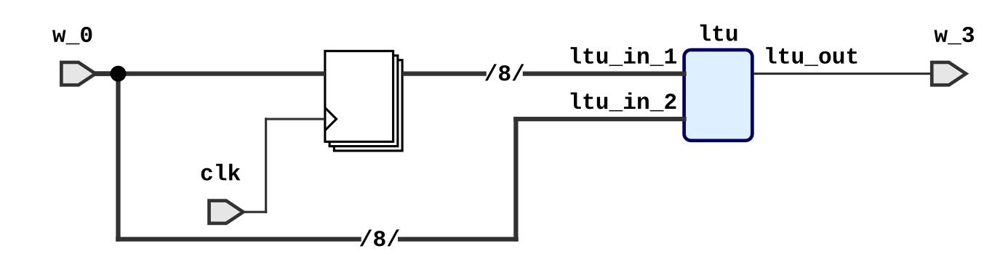

# SynQ
SynQ (**Syn**chronous System Design with **Q**uantitative Types) is an embedded domain-specific language (EDSL) for synchronous system design and an Idris2 package.

## Usage

 - Just as an Idris2 package (cf. [the official documentation](https://idris2.readthedocs.io/en/latest/reference/packages.html#using-package-files)).
 - The simulation functionality depends on C functions introduced as FFI, following [this document](https://idris2.readthedocs.io/en/latest/ffi/ffi.html#ffi-example) to compile `src/c/libbv.c` to `libbv.so` and put it in a proper location.
 - The generated Verilog HDL file consists of the top-level module only; components referred to in the file are defined in `src/verilog/components.v`.

## A Crash Course in SynQ

As its name suggests, SynQ is a DSL targeting the design of synchronous systems, which, intuitively, are reactive systems that always produce an event when an event is consumed.

```idris
import SynQ
```

<!-- idris
import Data.String
import Data.List1
import Language.Reflection

%hide Prelude.(>>=)
%hide Prelude.pure
%hide Data.Linear.Interface.seq
%hide Data.LState.(>>=)
%hide Data.LState.(<<<)
%ambiguity_depth 8

%language ElabReflection
-->

<!-- idris 
-- so that tye declaration of isIncr comes later
mutual
-->

```idris

  isIncr (MkReg get set) = abst $ \xin =>
    do pre <- get
       _   <- set xin
       pure $ ltu pre xin
```

```idris
  isIncr: (Seq comb seq, Primitive comb)
    => (1 reg: Reg UInt8 comb seq)
    -> seq (!* UInt8) UInt8 (BitVec 1)
```
<!--
mutual end
-->

## Run as a program
```idris
%unhide Prelude.(>>=)
%unhide Prelude.pure

input: IO UInt8
input = do str <- getLine
           Just x <- pure $ parseInteger {a=Integer} str
             | _ => do putStrLn "{\"warning\": \" Not integer, treat as zero\"}\n" 
                       pure $ BV 0
           pure $ BV $ fromInteger x
           
reactIsIncr: IO ()
reactIsIncr = runReact input (isIncr reg) (MkBang $ BV 0)

%hide Prelude.(>>=)
%hide Prelude.pure

```


<!-- idris
  
sine: List1 UInt8
sine = 100 ::: [119, 138, 155, 170, 183, 192, 198, 200, 198, 192, 183, 170,
                155, 138, 119, 100,  80,  61,  44,  29,  16,   7,   1,   0, 
                  1,   7,  16,  29,  44,  61,  80]

sineLut: (Primitive comb) => comb () UInt8 -> comb () UInt8
sineLut = %runElab lutGen sine

sineSig: (Seq comb seq, Primitive comb)
  => (1 reg: Reg UInt8 comb seq)
  -> seq (!* UInt8) () UInt8
sineSig (MkReg get set) = 
  do cur_idx <- get
     o <- pure $ sineLut cur_idx
     _ <- set (mux21 (ltu cur_idx $ const $ 31)
                     (slice 0 8 $ add cur_idx $ const $ 1)
                     (const $ 0))
     pure o
     
sineSigProg: IO ()
sineSigProg = putStrLn $ show $ 
                runMealy (sineSig reg) (MkBang 0) 
                  {- sample 32 events -}
                  [(), (), (), (), (), (), (), (), 
                   (), (), (), (), (), (), (), (), 
                   (), (), (), (), (), (), (), (), 
                   (), (), (), (), (), (), (), ()]
              
genSine: IO ()
genSine = writeVerilog "sine" (sineSig reg)
-->

## Generate HDL
```idris
genDemo: IO ()
genDemo = writeVerilog "demo_sys" (isIncr reg)
```

```bash
λΠ> :exec genHDL
```




## Unrestricted Register Usage

```idris
test: (Seq comb seq, Primitive comb, 
       Reg UInt8 comb seq)
  => seq (!* UInt8) UInt8 UInt8
test = abst $ \x => 
  do o  <- get
     _  <- set (const 42)
     x1 <- get
     x2 <- get
     _  <- set x
     pure x2

testHDL: IO ()
testHDL = writeVerilog "seq_assign" $ test {comb = NetList.Combinational}

```


## Prove Properties
```idris
%default total
isIncrMealy: (st: !* UInt8) 
  -> List UInt8 -> (List $ BitVec 1)
isIncrMealy = runMealyIO (isIncr reg)

isIncrMealyPropP: (st: !* UInt8) 
  -> (xs: List UInt8) -> (x: UInt8) -> (y: UInt8)
  -> (p_ltu: bvLtu x y = BV 1)
  -> (ys: List (BitVec 1) ** (isIncrMealy st (xs ++ [x] ++ [y])) = ys ++ [BV 1])
isIncrMealyPropP (MkBang st) [] x y p_ltu = 
  rewrite p_ltu in ([bvLtu st x] ** Refl)
isIncrMealyPropP (MkBang st) (st' :: xs) x y p_ltu = 
  let (ys ** prf) = isIncrMealyPropP (MkBang st') xs x y p_ltu
  in rewrite prf in (bvLtu st st' :: ys ** Refl)

isIncrMealyPropN: (st: !* UInt8) 
  -> (xs: List UInt8) -> (x: UInt8) -> (y: UInt8)
  -> (p_ltu: bvLtu x y = BV 0)
  -> (ys: List (BitVec 1) ** (isIncrMealy st (xs ++ [x] ++ [y])) = ys ++ [BV 0])
isIncrMealyPropN (MkBang st) [] x y p_ltu = 
  rewrite p_ltu in ([bvLtu st x] ** Refl)
isIncrMealyPropN (MkBang st) (st' :: xs) x y p_ltu = 
  let (ys ** prf) = isIncrMealyPropN (MkBang st') xs x y p_ltu
  in rewrite prf in (bvLtu st st' :: ys ** Refl)
      
```
